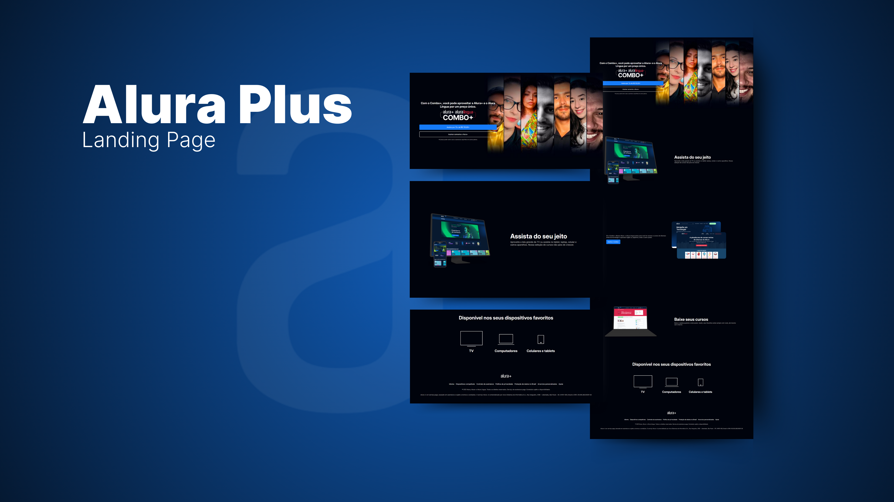

<h1 align="center">✨ Alura Plus ✨</h1>

  <a href="#-tecnologias">Tecnologias</a>&nbsp;&nbsp;&nbsp;|&nbsp;&nbsp;&nbsp;
  <a href="#-projeto">Projeto</a>&nbsp;&nbsp;&nbsp;|&nbsp;&nbsp;&nbsp;
  <a href="#memo-licença">Licença</a>

  

 

## 📖 Descrição

O Alura Plus é um serviço que combina o Alura+ e o Alura Língua, oferecendo acesso a cursos de diversas áreas da tecnologia e aprendizado de idiomas. Este projeto visa facilitar o acesso a conteúdos educacionais de qualidade e promover o aprendizado contínuo.

## 🚀 Tecnologias

Esse projeto foi desenvolvido com as seguintes tecnologias:

- HTML e CSS
- JavaScript
- Git e Github
- Figma

## 💻 Projeto

O Alura Plus oferece uma plataforma intuitiva para usuários explorarem cursos em tecnologia e idiomas, com uma interface amigável e recursos que facilitam o aprendizado.

- [Acesse o deploy](https://alura-plus-sigma-smoky.vercel.app/)

## 🤝 Contribuições

Contribuições são bem-vindas! Sinta-se à vontade para abrir uma issue ou enviar um pull request.

## :memo: Licença

Esse projeto está sob a licença MIT.

---

Feito com ♥ por [Thalita Noemi](https://www.linkedin.com/in/thalita-noemi/) :wave:
